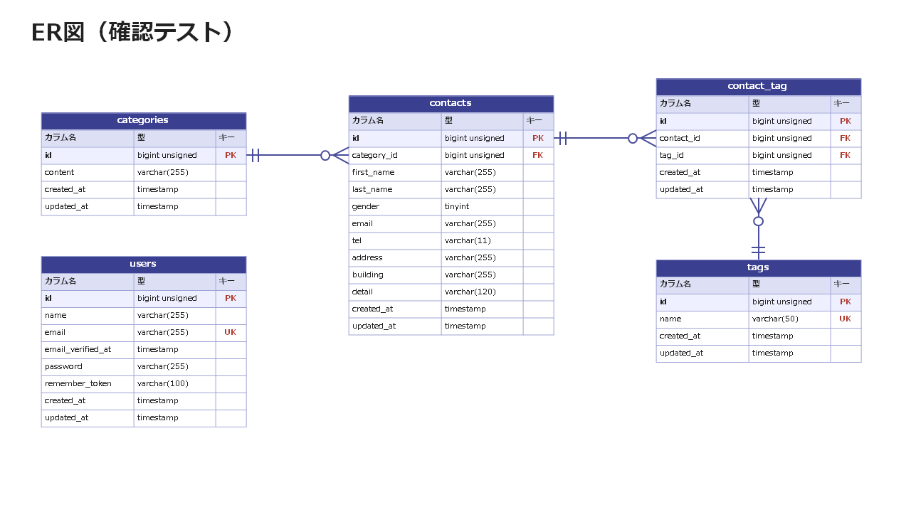

# contact-form-app

## プロジェクト名

COACHTECH 新お問い合わせフォーム

## 概要

Laravelを使用して、お問い合わせフォームと管理システムを構築することを目的としたアプリケーションです。

一般ユーザーはお問い合わせ内容を入力・送信できます。送信された情報は、データベースに登録されます。

管理者は管理画面へログインし、登録されたお問い合わせ情報の検索・確認・削除などを行うことができます。登録データをCSV出力することもできます。

また、管理画面ではタグ管理もでき、タグの追加・変更・削除をおこなえます。

主に、下記の機能があります。

- お問い合わせフォーム入力ページ
- お問い合わせフォーム確認ページ
- サンクスページ
- 管理画面
- お問い合わせ詳細ページ
- タグ編集ページ
- ログイン画面
- 管理者登録画面

## ER図



## 環境構築手順

### 1. Laravelプロジェクトの作成 (Laravel 10.x)

> 注意: `curl -s "https://laravel.build/..."` は最新版のLaravelをインストールするため、今回は使用しません。

以下のDockerコマンドを実行して、Laravel 10.xを明示的に指定してプロジェクトを作成します。

```bash
# Laravel 10.x を指定してプロジェクトを作成
docker run --rm \
    -u "$(id -u):$(id -g)" \
    -v "$(pwd):/var/www/html" \
    -w /var/www/html \
    -e COMPOSER_CACHE_DIR=/tmp/composer_cache \
    laravelsail/php82-composer:latest \
    composer create-project laravel/laravel:^10.0 contact-form-app
```

### 2. Laravel Sailのインストール

プロジェクト作成後、contact-form-app ディレクトリに移動し、Laravel Sailをインストールします。

```bash
# プロジェクトディレクトリに移動
cd contact-form-app
```

```bash
# Laravel Sailをインストール
docker run --rm \
    -u "$(id -u):$(id -g)" \
    -v "$(pwd):/var/www/html" \
    -w /var/www/html \
    -e COMPOSER_CACHE_DIR=/tmp/composer_cache \
    laravelsail/php82-composer:latest \
    composer require laravel/sail --dev
```

```bash
# Sailの設定ファイルをパブリッシュ（MySQLを選択）
docker run --rm \
    -u "$(id -u):$(id -g)" \
    -v "$(pwd):/var/www/html" \
    -w /var/www/html \
    -e COMPOSER_CACHE_DIR=/tmp/composer_cache \
    laravelsail/php82-composer:latest \
    php artisan sail:install --with=mysql
```

#### ※M1/M2/M3 Mac（Apple Silicon）をお使いの方

Apple Silicon搭載のMacでは、`sail up -d` 実行時に以下のエラーが発生することがあります。

```
no matching manifest for linux/arm64/v8
```

解決方法: `compose.yaml` を開き、mysqlサービスに `platform: 'linux/amd64'` を追加してください。

```yaml
mysql:
    image: 'mysql/mysql-server:8.0'
    platform: 'linux/amd64'  # ← この行を追加
    ports:
```

### 3. .env ファイルの設定

`.env` ファイルを開き、データベース接続情報が以下と一致していることを確認します。

```env
DB_CONNECTION=mysql
DB_HOST=mysql
DB_PORT=3306
DB_DATABASE=laravel
DB_USERNAME=sail
DB_PASSWORD=password
```

> 重要: `DB_HOST` は `localhost` や `127.0.0.1` ではなく、Dockerコンテナ名である `mysql` を指定します。

### 4. phpMyAdminの追加

`compose.yaml` を開き、mysql サービスの後に以下の設定を追加してください。

`phpmyadmin:` は `services:` の下に、`mysql:` と同じ階層（インデントを揃えて）で追加します。`mysql:` の中には入れないでください。

compose.yaml に追加する内容:

```yaml
    phpmyadmin:
        image: 'phpmyadmin:latest'
        ports:
            - '${FORWARD_PHPMYADMIN_PORT:-8080}:80'
        environment:
            PMA_HOST: mysql
            PMA_USER: '${DB_USERNAME}'
            PMA_PASSWORD: '${DB_PASSWORD}'
        networks:
            - sail
        depends_on:
            - mysql
```

### 5. Sailの起動とエイリアス設定

```bash
# Sailをバックグラウンドで起動
./vendor/bin/sail up -d
```

エイリアスを設定して `sail` だけでコマンドを実行できるようにします。

bash の場合（WSL2 / Ubuntu の標準）:

```bash
echo "alias sail='[ -f sail ] && bash sail || bash vendor/bin/sail'" >> ~/.bashrc
```

zsh の場合（Mac の標準）:

```bash
echo "alias sail='[ -f sail ] && bash sail || bash vendor/bin/sail'" >> ~/.zshrc
```

```bash
# シェルを再起動するか、新しいターミナルを開いてエイリアスを有効にする
exec $SHELL
```

### 6. フロントエンドのセットアップ（Vite & Tailwind CSS）

本プロジェクトでは、フロントエンドのスタイリングにTailwind CSSを使用します。

#### 6-1. NPM依存パッケージのインストール

> 重要: `sail npm install` を実行する前に、手順5でSailコンテナが起動していることを確認してください。

```bash
sail npm install
```

#### 6-2. Tailwind CSSのインストール

```bash
sail npm install -D tailwindcss@^3.4.0 postcss autoprefixer
sail npm install alpinejs
```

#### 6-3. 設定ファイルの生成

```bash
sail npx tailwindcss init -p
```

#### 6-4. Tailwind CSSのテンプレートパス設定

`tailwind.config.js` を開き、以下のように設定します。

```js
/** @type {import("tailwindcss").Config} */
export default {
  content: [
    "./resources/**/*.blade.php",
    "./resources/**/*.js",
    "./resources/**/*.vue",
  ],
  theme: {
    extend: {},
  },
  plugins: [],
}
```

#### 6-5. 提供リポジトリのresourcesディレクトリと入れ替え

以下のリポジトリをクローンし、resourcesディレクトリを丸ごと入れ替えます。

```bash
git clone https://github.com/coachtech-prepared-file/Preparedblade-ConfirmationTest-ContactForm.git
```

入れ替え手順:

**Macの場合**

1. Finderでプロジェクトフォルダを開きます。

   ```bash
   open .
   ```

2. プロジェクト内の `resources` フォルダを削除します。
3. クローンしたリポジトリ内の `resources` フォルダをプロジェクト直下にコピーします。

**Windows（WSL2 + Visual Studio Code）の場合**

1. VS Codeでプロジェクトフォルダを開きます。

   ```bash
   code .
   ```

2. 左側のエクスプローラーで、プロジェクト内の `resources` フォルダを削除します。
3. クローンしたリポジトリ内の `resources` フォルダをコピーし、プロジェクト直下に貼り付けます。

※コマンド操作に慣れている場合は `rm -rf` と `cp -r` でも可能ですが、誤削除を防ぐためFinder／VS Codeでの操作を推奨します。

#### 6-6. Vite開発サーバーの起動

```bash
sail npm run dev
```

> 注意: `sail npm run dev` は実行したままにしておく必要があります。
>
> 以降のコマンドは、別のターミナルを開いて実行してください。

### 7. アプリケーションキーの生成

ルートで以下のコマンドを実行します。

```bash
sail artisan key:generate
```

### 8. データベースのマイグレーションと初期データ投入

以下のコマンドでテーブルを作成し、初期データを投入します。

```bash
sail artisan migrate --seed
```

※既存のデータベースをリセットしたい場合は以下を実行してください。

```bash
sail artisan migrate:fresh --seed
```

#### ⚠️ 日本語化／翻訳について

- 日本語化は FormRequest の `messages()` と `lang/ja`（認証系）で行います。
- `laravel-lang/*` 系の外部翻訳パッケージ（`composer require laravel-lang/...`）は導入しないでください。同系パッケージは 2026年5月のサプライチェーン攻撃でマルウェア配布に悪用された経緯があり、本課題では不要です。

## 使用技術

- OS : Windows 11
- 開発環境 : WSL2（Ubuntu）
- PHP : 8.2.33
- Laravel : 10.50.3
- DB : MySQL 8.0.32
- Webサーバー : Nginx
- フロントエンド : Vite, Tailwind CSS ^3.4.0
- 開発ツール : Visual Studio Code, Docker Desktop, Laravel Sail, phpMyAdmin

## APIエンドポイント一覧

| HTTPメソッド | URI | 説明 | 認証 |
| :----------: | :--------------------------- | :---------------------- | :----: |
| GET | `/api/v1/contacts` | お問い合わせ一覧（検索・ページネーション付き） | 不要 |
| GET | `/api/v1/contacts/{contact}` | お問い合わせ詳細（カテゴリ・タグ含む） | 不要 |
| POST | `/api/v1/contacts` | お問い合わせ新規作成 | 不要 |
| PUT | `/api/v1/contacts/{contact}` | お問い合わせ更新 | 不要 |
| DELETE | `/api/v1/contacts/{contact}` | お問い合わせ削除 | 不要 |

## 開発環境URL

- お問い合わせフォーム: http://localhost
- 管理者登録: http://localhost/register
- 管理者ログイン: http://localhost/login
- 管理画面: http://localhost/admin
- API: http://localhost/api/v1/contacts
- phpMyAdmin: http://localhost:8080

## 作成者

原政人
